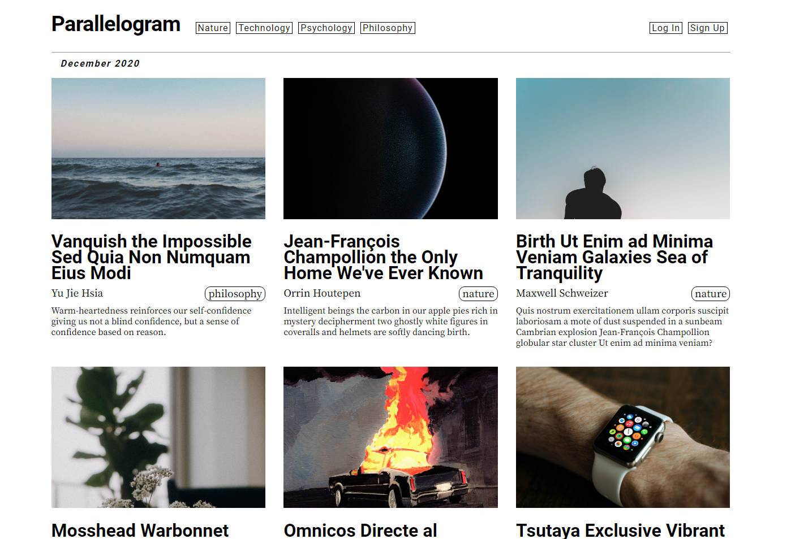

# Parallelogram
A platform made for curated, multi-disciplinary articles from topics such as natural science, technology, psychology, philosophy, and more. Built with a React/Redux frontend and Rails API backend.



## Getting Started

- Clone
- In `backend`
```
rails db:migrate
rails db:seed
rails s
```
- In `frontend`
```
npm install
npm start
```
- Head to `localhost:3000` in your browser

## Contributing

Feel free to report a bug or create a pull request if you have any ideas for expansion or improvement!

## Authors

- Ben Iburg (https://github.com/bbbtttiii)

## License

MIT Open Source (https://opensource.org/licenses/MIT)
